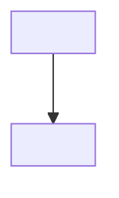

<!--
  ARCHITECTURE.md — CHARTER: what the system IS, at a level that stays true across features.
  MUST contain: mode instruction, stack + versions, module structure and boundaries, folder
  layout, API style, state, error/logging policy, auth/security, config, NFRs.
  MUST NOT contain: entity attributes (→ DATA-MODEL.md), code-style minutiae (→ CONVENTIONS.md),
  the rationale behind a choice (→ DECISIONS.md — state the decision here, log the why there),
  or per-feature detail.
  This is the file an executing agent reads to know what it is allowed to assume.
-->

# <Project> — Architecture

**Mode:** <greenfield → scaffold this stack from scratch | brownfield → extend the existing
codebase, do NOT scaffold>

## Stack
<Concrete, with versions. Greenfield: what the user chose. Brownfield: what the repo has,
verbatim from the manifest. Never a stack that was neither chosen nor found. Delete rows that
do not apply; add rows that do.>

| Layer | Choice | Version | Notes |
| ----- | ------ | ------- | ----- |
| Language | <> | <> | |
| Framework | <> | <> | |
| Data store | <> | <> | |
| Data access / ORM | <> | <> | |
| Auth | <> | <> | |
| Package manager | <> | <> | |
| Test runner | <> | <> | |
| Build / bundler | <> | <> | |
| Hosting / runtime | <> | <> | |

## Module structure & boundaries
<2–4 paragraphs: the major modules or services, each with one clear responsibility and a
defined interface, and how they communicate. Name the boundaries that must not be crossed.>



## Folder structure
```
<the layout the project uses, or will use after scaffolding>
```

## API & interface style
<REST / GraphQL / RPC / CLI. Resource naming, versioning, request and response envelope,
status-code policy, pagination. Shape and policy only — not individual endpoints.>

## State & data flow
<Source-of-truth rules, client and server state approach, caching and invalidation policy.>

## Error handling & logging
<How errors are represented, surfaced to the user, and logged. Project-wide policy only.>

## Auth & security
<Authentication and authorisation model, session or token handling, secret management, trust
boundaries, input-validation policy.>

## Configuration & environments
<Where config comes from, the environment matrix, feature flags if any.>

## Non-functional requirements
<Budgets and targets an implementation must meet. Each one checkable.>

| Requirement | Target |
| ----------- | ------ |
| <performance> | <budget> |
| <scale> | <target> |
| <availability> | <target> |

## Build & deploy outline
<How it builds, how it ships, what runs in CI. The gates themselves live in QUALITY.md.>

## Open architectural questions
<Only if any — and each one must also exist as an open ADR in DECISIONS.md. Never "TBD".>

- <question, stated as a question> → `DECISIONS.md` ADR-NNN
