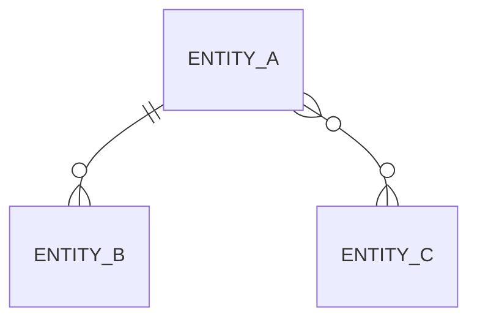

<!--
  DATA-MODEL.md — CHARTER: the domain data. Entities, their business attributes, and how they
  relate. Storage-agnostic. CONDITIONAL: write it only if the project has a real data layer.
  MUST contain: entities with business attributes, relationships, invariants, lifecycles.
  MUST NOT contain: migration SQL, ORM or model code, index tuning, or fields that belong to
  one feature only.
  Describe entities precisely enough that an agent derives the schema without being handed it.
-->

# <Project> — Data Model

**Data store:** <name it, from ARCHITECTURE.md — do not re-decide it here>

## Entities

### <Entity>
- **Represents:** <what it is in the domain>
- **Identity:** <what uniquely identifies one>
- **Key attributes:** <attribute — what it means>; <attribute — what it means>
- **Owned by:** <which module, if the architecture has boundaries>

### <Entity>
- **Represents:** <>
- **Identity:** <>
- **Key attributes:** <>

## Relationships

<Then the same relationships in business language: "a booking belongs to one customer and has
many rooms; a room can appear in many bookings over time".>

## Invariants
<Rules that must always hold, in business terms. These become validations and tests.>

- <e.g. an order's total always equals the sum of its line items>
- <e.g. a user's email is unique across the system>

## Lifecycles
<For entities with meaningful states: the states and the allowed transitions. Omit entities
that have none.>

- **<Entity>:** <state> → <state> → <state> <!-- and which transitions are irreversible -->

## Retention & privacy
<What is personal data, how long anything is kept, what deletion means. Drop if not relevant.>
